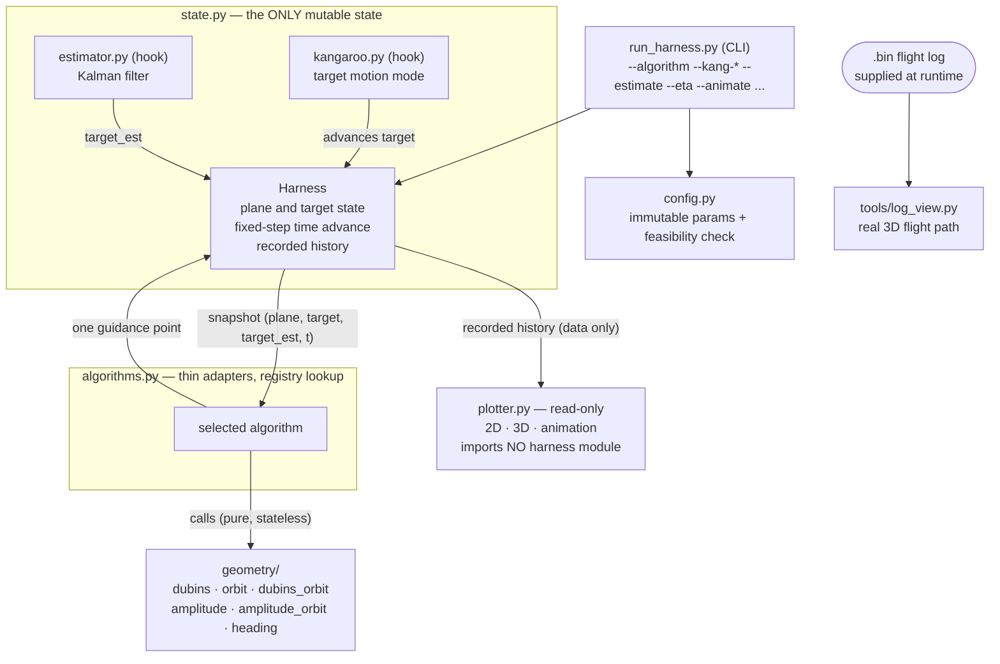

# Offline geometric validation harness

A small Python harness for **validating leader-follower guidance geometry** before
it is ported to ArduPilot Lua. It flies a kinematic aircraft against a moving
"kangaroo" target, swaps guidance algorithms behind one interface, and plots the
result. Python is the validation language; Lua is the target.

**Status:** running; **nothing here is verified flight evidence.** It validates
*geometry*, not tracking (`A-VAL-001`). Tracked by the tasks under
`tasks/active/` (`TASK-001` onward).

---

## System at a glance



**The one rule that shapes everything:** the **algorithm** is stateless and only
reads a snapshot; the **state** module owns all mutable state (and optionally a
target-motion mode and an estimator); the **plotter** is read-only and imports no
harness module. Swapping a guidance law is a change to `--algorithm` and nothing
else (`VR-014`).

---

## Quick start

Run everything from the scripts directory:

```bash
cd src/ardupilot/scripts

# Approach a target and orbit it (the default algorithm)
python3 -m py_harness.run_harness --algorithm dubins_orbit

# Compare several algorithms on the same axes (identical initial conditions)
python3 -m py_harness.run_harness \
    --algorithm dubins_orbit --algorithm amplitude_orbit --algorithm heading_a_orbit --estimate

# Skip the plot, print the summary only
python3 -m py_harness.run_harness --algorithm orbit --no-plot
```

`--help` lists every flag.

---

## Key components — what to run

### 1. Guidance algorithms (`--algorithm`, repeatable)

| `--algorithm` | Behaviour |
|---|---|
| `dubins` | Shortest of six Dubins families to the target; terminates on arrival. |
| `orbit` | Circles the target on the ring. |
| `dubins_orbit` | Dubins approach tangent to the ring, **ramped** into the orbit. |
| `amplitude` | The shipping continuous **weave** (plane-anchored). Alias: `continuous_weave`. |
| `amplitude_orbit` | Weave approach ramped into the orbit. |
| `heading_a` | Simple **heading-alignment** fly-to the (estimated) target. |
| `heading_a_orbit` | Heading fly-to ramped into the orbit. |

Selection is a pure registry lookup — no other part of the harness branches on the
algorithm.

### 2. Target motion — the kangaroo (`--kang-mode`)

Four deterministic modes ported from `kangaroo_MAV.lua` (`TASK-009`). The target
advances state-side; the algorithm is unaffected.

```bash
# Target circles; the plane follows
python3 -m py_harness.run_harness --algorithm dubins_orbit --kang-mode circle --kang-radius-m 150

# Target traces a rectangle
python3 -m py_harness.run_harness --algorithm dubins_orbit --kang-mode rectangle \
    --kang-length-m 300 --kang-width-m 200 --kang-speed-ms 6
```

Modes: `point` (stationary), `straight`, `circle`, `rectangle`. Parameters:
`--kang-heading-deg --kang-fwd-m --kang-disp-m --kang-radius-m --kang-length-m
--kang-width-m --kang-speed-ms`. (A simpler moving target is also available with
`--target-speed-ms`/`--target-heading-deg`.)

### 3. State estimator (`--estimate`)

Runs the ported Kalman filter (`estimator.py`, `TASK-012`) and feeds algorithms
the **estimated** target through the snapshot's `target_est`. Required by the
`heading_a` family.

```bash
python3 -m py_harness.run_harness --algorithm heading_a_orbit --estimate --kang-mode straight
```

### 4. The amplitude weave and its safety factor (`--compare-eta`)

The weave amplitude is limited so its curvature never exceeds `1/R_min`. The
safety factor `eta` scales that cap; `--compare-eta` overlays `eta` against
`eta = 1`.

```bash
python3 -m py_harness.run_harness --algorithm amplitude --compare-eta \
    --weave-lambda 300 --weave-a-cap 60
```

Knobs: `--eta --weave-lambda --weave-a-cap --weave-d-start --weave-d-full`. See
`TASK-004` for the wavelength trade-off (large *or* frequent waves, not both).

### 5. Plotting and animation

```bash
# Static 2D + 3D (default shows both; --no-3d for 2D only)
python3 -m py_harness.run_harness --algorithm dubins_orbit --save-plot out.png

# Time animation (GIF): the plane's path grows, the ring travels with the target
python3 -m py_harness.run_harness --algorithm dubins_orbit --kang-mode circle --animate out.gif
```

Plot saved runs later, in a separate step (the plotter takes **files, not
algorithm names**):

```bash
python3 -m py_harness.run_harness --algorithm dubins_orbit --save-run runs/cmp.json --no-plot
python3 -m py_harness.plotter runs/cmp-*.json --orbit-radius-m 70
```

### 6. Real flight logs (separate tool)

`tools/log_view.py` (`TASK-007`, in the **parent** repo) renders an ArduPilot
`.bin` log in 3D, in local metres about the log origin:

```bash
cd /path/to/ResearchProject
python3 -m tools.log_view path/to/flight.bin --save-plot flight3d.png
```

The log is supplied at runtime and never enters the repository; only local metres
are printed (no absolute GPS).

---

## Configuration and feasibility

Parameters live in `config.py` — one immutable module, units and provenance on
every value. Directed 2026-07-22: airspeed **25 m/s**, turn radius **45 m**, orbit
radius **70 m**.

The **harness bank limit is 60 degrees** (`ADR-002`, raised from 45 by direction),
which makes the 45 m turn radius **feasible** (54.8 deg, 1.73 g) — so a default run
no longer needs `--allow-infeasible`. This **diverges from the flight code**, which
still holds 45 degrees; the harness value is a modelling choice, not an approved
limit (`SR-004`). A radius below the 36.80 m floor is still refused unless
`--allow-infeasible` is passed.

**Commanded is not achieved.** A guidance point placed a look-ahead ahead on the
ring is chased from *inside* it, so the flown circle is smaller than commanded
(`A-VAL-005`). The harness measures and prints this each orbit run; it is
reported, not corrected.

---

## Rules for an algorithm (`DEC-2026-06-25-04`)

An algorithm must transliterate to ArduPilot Lua, or it has not validated the
thing that will actually fly:

- Plain floats in plain dicts in and out — they map onto Lua tables.
- No `numpy` inside an algorithm (the geometry is plain `math`).
- No closures over mutable module state. Accumulated state travels through the
  snapshot's `algorithm_state`; the weave's arc-length phase is derived from the
  snapshot's `t` and speed.
- Returns a **single guidance point**, matching what `control_cont.lua:370`
  commands through `vehicle:set_target_location()`. Not a path.

`geometry/` holds no state at all — no globals, no matplotlib, no time. That is
what lets the same functions serve the harness and a later Lua port.

---

## Module map

| File | Responsibility |
|---|---|
| `config.py` | Flight and weave parameters, derived bank angles, feasibility. Immutable; malformed parameters raise. |
| `interface.py` | The algorithm contract: snapshot fields (incl. `target_est`), return value, units, frame, no-solution convention. No geometry. |
| `state.py` | Plane and target state, fixed-step advance, history. Optional `kangaroo` and `estimator` hooks. No geometry, no plotting. |
| `kangaroo.py` | Target motion modes (point/straight/circle/rectangle). Stateless. |
| `estimator.py` | 2D constant-velocity Kalman filter (ported; keeps the Lua's approximations). |
| `algorithms.py` | Thin adapters and the name registry. Convert frames, call geometry, pick one point. **No maths.** |
| `geometry/*.py` | The maths — `dubins`, `orbit`, `dubins_orbit`, `amplitude`, `amplitude_orbit`, `heading`. Stateless, `math` only. |
| `plotter.py` | Read-only plotter (2D/3D/animation). **Imports no harness module** (`DEC-2026-07-22-01`). |
| `run_harness.py` | Entry point and CLI. |

---

## Tests

In the parent repository, because `tests/` belongs there:

```bash
cd /path/to/ResearchProject && python3 -m pytest tests/unit -q   # 232 passed
```

The tests are offline and synthetic (no `.bin`, no Lua under test). They show the
geometry ports are **faithful**, not that the originals are **correct** — the
`py_plots/` originals carry no tests either.

---

## Limitations

A kinematic model: no L1, TECS, EKF or airframe response. It validates **geometry**,
not **tracking**, and must not be cited for `SR-001`–`SR-003` (`A-VAL-001`).

Whether the harness is *normative* (the Lua must reproduce it within a tolerance)
or *exploratory only* is unresolved (`DEC-2026-06-25-05`).

## Version control

This directory sits inside the vendored ArduPilot checkout, which carries its own
nested `.git`. Files here **do not appear in the ResearchProject repository's
history**; the parent repo sees `src/ardupilot` as a single gitlink. Commit
changes here in the nested repository.
