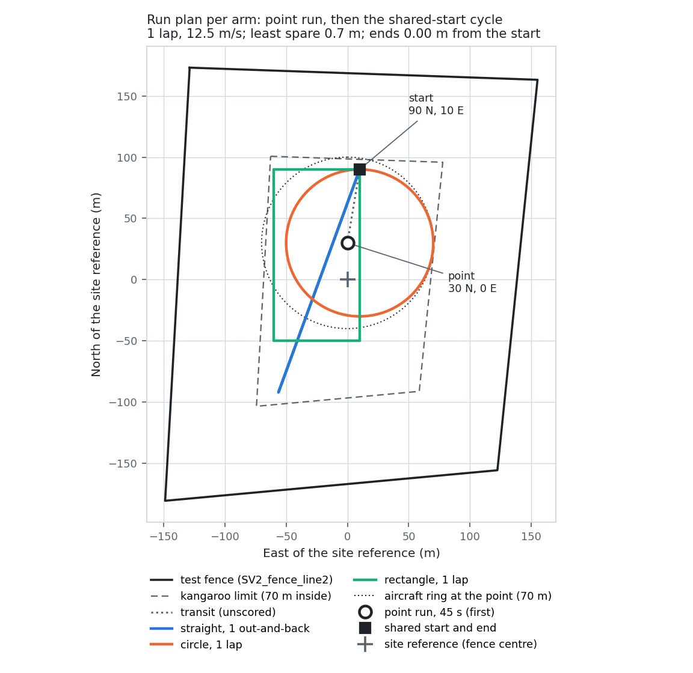
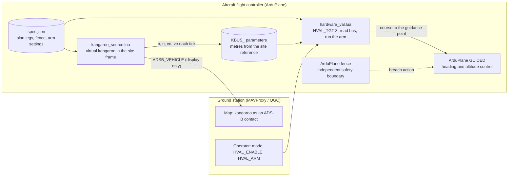

# Physical validation - Kangaroo Runs and Experimental Set up 

Summary, 10 October 2026

## The Site and fence line
- Fence: `sitl-runs/SV2_fence_line2.txt` is a rough recreation of the virtual kangaroo track that was flown in June. 
- Each side 300 m, 93,000 m^2; the deepest point is 138 m from the nearest wall.
- The kangaroo stays at least 70 m (the orbit radius `R`) inside every wall, so the aircraft ring can stay inside the boundary
- The ArduPlane fence on the aircraft stays the independent safety boundary, with a real action. 

## The algorithms to test
- THe three 'arms' being tested are:
  - **baseline** the baseline algorithm that regenerates a dubins curve, stand off, around the kangaroo, at a rate of 10 Hz.
  - **adaptive carrot** calculates the baseline and then offsets the carrot target by the estimated change in the kangaroo in the intervening time period at an interval of 0.1 seconds (1 tick, `af_step_ticks` 1, the best lead at the 30 m carrot in SITL; 8 ticks was best at 50 m) 
  - **adaptive baseline:** a state estimator to feed forward the position (for calculation), feeding forward the position at a interval of 2.5 seconds (25 ticks, `lookahead_steps` 25, replanned every tick) (in the code referred to as arm AH)

- The baseline will be flown as the first priority, folllowed by the adaptive carrot and the adaptive baseline if time permits. 
- Common set-up: airspeed 25 m/s, bank 60 deg (requires adjustment depending on plane), `R` stand offset 70 m, carrot 30 m (all arms), minimum turn radius 45 m, algorithm recacluation 10 Hz (100ms).
- Each arm flies the same schedule from the same placements (the point run, the transit, then the nine runs), active only (`HVAL_OUT` 1).
- Script heap: set `SCR_HEAP_SIZE` to the maximum of its range, 1048576 (1 MiB). Measured 2026-10-10 in SITL with both scripts on one aircraft (`hardware_val.lua` on `HVAL_TGT` 3 and `kangaroo_source.lua`) flying arm AH through the whole plan at a 1 MB heap: peak reported use 928 kB (including uncollected garbage) and no "Required SCR_HEAP_SIZE" warning, so about 120 kB of headroom at the maximum. 0H and FH have not yet been measured in the two-script layout. Confirm on the board with `SCR_DEBUG_OPTS` 2 (Sam-Follow-03 flew in 350 kB; `hardware_val.lua` alone needed more than 692 kB on 2026-10-07).

## The runs
- The core idea is that four kangaroo shapes are tested against
  - **point:** a single point for the kangaroo to hold, flown once, first, for 45 s (one 70 m orbit at 25 m/s takes 17.6 s, so this allows the approach and about two orbits);
  - **straight:** one out-and-back from the start to 10 m short of the 70 m limit and straight back: 194 m each way at heading 200 deg (389 m);
  - **circle:** radius 60 m, one lap (377 m);
  - **rectangle:** 140 x 70 m, one lap (420 m).
- Each geometry is flown at the three paces already implemented:
  - **constant:** constant speed at 12.5 m/s;
  - **elastic:** slows to 0.3 x speed for 8 seconds, with 4 second ramps;
  - **stop-start:** from full speed down to 0.1 x speed, holds, restarts.
- Nine runs per arm after the point run, with **no rests** (author, 2026-10-10): every run starts and ends at the shared start, so the runs chain directly. A run ends when the kangaroo has covered its distance, so paced runs take longer.

| Time per run (s) | Constant | Elastic | Stop-start |
|---|---|---|---|
| Straight, 12.5 m/s | 31 | 48 | 55 |
| Circle, 12.5 m/s | 30 | 46 | 54 |
| Rectangle, 12.5 m/s | 34 | 56 | 57 |

- Per arm: **459 s, 7.7 min** at 12.5 m/s, made up of the point run (45 s), the transit (5 s) and the nine runs (409 s). That is **23 min of runs for the three arms**.
- Ratio 0.5 is close to the 0.56 limit for holding the ring (`R/rho - 1`).


## Procedure
- One lap of each run (author, 2026-10-10), down from two, so each arm fits one battery. One lap follows the same path as two, so it fits the fence the same way and still ends at the shared start.
- Fly an arm per sortie: engage while the kangaroo holds at the point position (it holds there from boot), let the aircraft settle on the ring, then set `KSRC_RUN 5`. Land, swap `spec.json` for the next arm, and repeat.
- Not included: repeats, wind holds, battery changes and ground time between sorties (allow 10 to 15 min each).

## Fence estimates
- Only the shared-start cycle is flown. It is preceded by the point run, so each arm flies 11 runs in one fixed schedule:
  - **point run**, 45 s, at 30 m N, 0 m E of the site reference (the fence's deepest point), away from the shared start;
  - **transit** to the shared start, 61 m at 9.5 deg at 12.5 m/s, unscored;
  - **the nine runs** (straight, circle, rectangle, each at constant, elastic and stop-start pace), every one starting and ending at the shared start, 90 m N, 10 m E of the site reference.
- No repositioning between runs: the kangaroo is back at the start after each one.



*The run plan for one arm, in metres from the site reference (the fence centre): the point run and its 70 m aircraft ring, the transit, and the shared-start cycle (one lap, one out-and-back). Paths are identical at all three paces. Drawn from the plan configuration by `docs/figures/physical_validation_runs.py`.*

| Run | Heading | Least spare to the 70 m limit |
|---|---|---|
| Point, 45 s | n/a (stationary) | 66.5 m |
| Transit to the shared start | 9.5 deg | 9.0 m |
| Straight, 1 x out and back, 194 m | 200 deg out, 20 deg back | 8.2 m at the start; 10 m at the far end (by design) |
| Circle, 1 lap | 180 deg | 0.7 m |
| Rectangle, 1 lap | 180 deg | 3.3 m |
| **Whole plan** | | **0.7 m; the cycle ends 0.00 m from the start** |

- Sampled every 0.1 s on the exact kangaroo path; the plan is refused before staging if any sample is past the limit.
- 200 deg is the longest straight from the start (204 m to the limit; 180 deg gives 186 m).
- The 0.7 m on the circle is thin. In SITL on 2026-10-10 the vehicle's fence polygon came out about 0.9 m tighter than Python's: `kangaroo_source.lua` reported -0.2 m, a warning and not a fault. Consider `fit_margin_m` of at least 2 m in `pv_plan.json`. The backstops are the fence check before the plan is built, `kangaroo_source.lua`'s warning if the kangaroo passes the limit, and `hardware_val.lua`'s fault if the kangaroo leaves the fence.
- Do not use: the mode cycle's 40 s straights (90 m over at 6.25 m/s); the Sam-Follow-03 mission loop (its waypoints lie on this fence).

## Flight Time Estimate
- Battery reference: the prior experiment Sam-Follow-03 used 869 mAh in 8.7 min armed (about 100 mAh/min) on a 2,200 mAh pack (`BATT_CAPACITY`). Keeping 30% reserve gives about **15 min per pack**, about **10 min of runs** after take-off, climb, engagement and landing (about 5 min).
- Follow-03 cruised at 8 m/s (`AIRSPEED_CRUISE`); the plan assumes 25 m/s, which will draw more. Speed will need to be adjusted depending on the plane.
- Run time is a function of the kangaroo speed.

| Plan | Runs per arm | Three arms | Two arms (no AH) |
|---|---|---|---|
| 12.5 m/s, two laps, 120 s point, 10 s rests (previous) | 17.3 min | 52 min, about 6 sorties | 35 min, about 4 |
| 12.5 m/s, one lap, 45 s point, 10 s rests | 9.3 min | 28 min, 3 sorties (thin margin) | 19 min, 2 |
| **Chosen (author 2026-10-10):** 12.5 m/s, **one lap, 45 s point, no rests**, active only | **7.7 min** | **23 min, 3 sorties (one per arm), about 40 min airborne** | 15 min, 2 sorties |

- One arm per battery, with about 2 min of margin against the 10 min estimate. Check the real current draw on the first sortie.

## How the kangaroo reaches the aircraft
- The kangaroo is placed in the Spring Valley 2 site frame, never relative to the aircraft or to home.
  - The site reference is the centroid of the test fence's vertices, read from the fence configuration file, the same fixed point on every sortie.
  - The shared start (90 m N, 10 m E) and every heading above are relative to that point.
  - Home is not used: it is wherever the aircraft is armed, so it moves between sorties. 
  - The kangaroo - plane archirecture copies the same architecture as Sam-Follow-03 - with the two scripts (the following algorithm and the virtual kangaroo) flying on the aircraft's flight controller.
  - `kangaroo_source.lua` computes the kangaroo from boot, anchored at the site reference, and broadcasts it as ADS-B (for display). 
  - It passes the kangaroo to `hardware_val.lua` through `KBUS_` parameters, in metres from the site reference rather than degrees.
  - `hardware_val.lua` reads it as `HVAL_TGT` 3 and converts it into its own working frame, so the arm flies the same ground geometry wherever the pilot engages.
  


- `pv_plan.json` and `pv_plan.py` build one `spec.json` per arm on the ground (legs checked against the fence). The same file is staged for the SITL demo and for the aircraft.
- In SITL today, `kangaroo_demo.lua` plays the kangaroo and flies the arm in one script (suite mode); the two-script layout above is the target for the aircraft.
- `ADSB_TYPE` 0 and avoidance off, so the aircraft does not react to its own kangaroo.

## need to fix
- **`HVAL_TGT` 1 as it stands is not viable:** it places the kangaroo relative to the aircraft at engagement. If kept as a single-script fallback, it needs the same site-reference change.
- **Kangaroo modes: the ported ones, not `kangaroo_MAV.lua`'s.** `kangaroo_source.lua` uses `harness_segments` / `harness_kangaroo`, the same code the Python harness, SITL runner and `hardware_val.lua` run, gated against the Python. That is what makes a flight comparable with the Python run of the same arm, and it carries the elastic and stop-start paces and the fence turn. Follow-03's modes were time-integrated with their own maths and a clock-seeded random mode, so a flight with them cannot be replayed against the harness. Only Follow-03's ADS-B framing is reused (already in `sitl_adsb.lua`).
- **Geometry sizes:** the circle (60 m) and rectangle (140 x 70 m) are the project defaults (`kangaroo.DEFAULT_GEOMETRY`), chosen on 2026-10-07 for the earlier test fence (`springvalley2-test-fence.txt`, `ADR-012`), not for `SV2_fence_line2`. They fit it (largest that fit: circle about 65 m radius, 2:1 rectangle about 180 x 90 m). The straight's 194 m, the headings and the shared start were fitted to `SV2_fence_line2`.
- **Generating the runs:** in Python, as ordinary `spec.json` legs from the site reference. They are then fixed, checked against the fence before flight, and replayable against the Python run of the same arm.

## Open items before flying this
- **AH:** ported and gated against the Python (2026-10-10); still to fly in SITL through `hardware_val.lua` and to check heap and tick time on the board. - answer - update the configuration file for the SITL demo validation
- **Option B:** implement and test it (site reference, bus, ADS-B, `HVAL_TGT` 3). The alternative is a site-referenced `HVAL_TGT` 1; today's aircraft-relative `HVAL_TGT` 1 is not viable. - no worries
- **Python suite builder:** write it, with a fence check per geometry. -  ANswer - checking in SITL instead
- **Turn-radius check:** it faults at about 27.6 m/s true airspeed with a 45 m turn radius at 60 deg (`docs/HARDWARE_VAL_BOOT_REVIEW.md`, third pass). -answer - make the bank angle 60 degrees in the configuration 
- **Script heap:** set `SCR_HEAP_SIZE` to the maximum of its range, 1048576 (1 MiB). Measured 2026-10-10 in SITL with both scripts on one aircraft (`hardware_val.lua` on `HVAL_TGT` 3 and `kangaroo_source.lua`) flying arm AH through the whole plan at a 1 MB heap: peak reported use 928 kB (including uncollected garbage) and no "Required SCR_HEAP_SIZE" warning, so about 120 kB of headroom at the maximum. 0H and FH have not yet been measured in the two-script layout. Confirm on the board with `SCR_DEBUG_OPTS` 2 (Sam-Follow-03 flew in 350 kB; `hardware_val.lua` alone needed more than 692 kB on 2026-10-07). - Note the script heap in the content above
- **Flight card:**
  - `ADSB_TYPE` 0 and avoidance off, so the aircraft ignores its own kangaroo;
  - the fence loaded on the aircraft with a real action;
  - `FH` staged at `af_step_ticks` 1, every arm at the 30 m carrot (both from `spec.json`).
- **Sortie plan:** the shared-start cycle per arm, or split by geometry across sorties, at the chosen kangaroo speed. ANSWER - the plan is organised by the same algorithm flying across the geometries, and then once finished changing to the next RM
- **Geometry sizes:** the circle (60 m) and rectangle (140 x 70 m) are the project defaults (`kangaroo.DEFAULT_GEOMETRY`), chosen on 2026-10-07 for the earlier test fence (`springvalley2-test-fence.txt`, `ADR-012`), not for `SV2_fence_line2`. They fit it (largest that fit: circle about 65 m radius, 2:1 rectangle about 180 x 90 m). The straight's 194 m, the headings and the shared start were fitted to `SV2_fence_line2`. ANSWER this is fine
- **Generating the runs:** in Python, as ordinary `spec.json` legs from the site reference. They are then fixed, checked against the fence before flight, and replayable against the Python run of the same arm. - AnSWER - Reflect this in the spec so i can test it in the demo file before finishing off the hardware_val and the kangaroo_source and sending it off to the supervisor. 


## Open items: what has been done (2026-10-10)
- **AH:** in the SITL demo configuration as arm `AH` of `pv_plan.json` (`adaptive_db_circle_hyst`, 25-tick prediction, replanned every tick, plan held, 30 m carrot). Not yet flown in SITL: the carrot and lead checks were flown with 0H and FH only.
- **Python suite builder:** not built as a separate tool. The legs are generated once by `pv_plan.py` into each arm's `spec.json`, refused there if they leave the fence, and checked by flying them in the SITL demo (suite mode).
- **Turn radius:** bank 60 deg in the configuration (`pv_plan.json` `bank_limit_deg` 60, written to the spec as `roll_limit_deg` 60; set `ROLL_LIMIT_DEG` 60). At 25 m/s that is a 36.8 m turn, inside the 45 m the arms plan with.
- **Script heap:** measured 2026-10-10 (two scripts, arm AH, whole plan, SITL): peak 928 kB at a 1 MB heap, no heap warning. Set `SCR_HEAP_SIZE` 1048576 (its maximum); recorded in the common set-up, the plan's flight-card block (`pv_plan.json`) and both scripts' headers. Script update time in that run (PC SITL): `hardware_val.lua` median 12.5 ms, 95th percentile 27 ms, worst 84 ms; `kangaroo_source.lua` median 3 ms, 95th percentile 10 ms, worst 87 ms. A board is slower, so bench timing stays a gate.
- **Sortie plan:** arm-major in `pv_plan.json` (`order`: 0H, FH, AH); one arm flies the whole plan, then the next is staged.
- **Point mode:** added as the first run, at the fence's deepest point, away from the shared start.
- **Carrot and FH lead (SITL, 2026-10-10): 30 m carrot, FH lead 1 tick, set in `pv_plan.json`.** 44 SITL flights over carrots of 25 to 70 m. 25 m does not fly (no arm holds the ring). From 35 m up the orbit about a still kangaroo is lumpy (the bank swings to its limit 6 to 15 times a minute); 30 m holds a steady bank. At 30 m, over 18 flights, FH's best lead is 1 tick (moving cases 36.7 m mean error, against 39.1 m for the baseline and 40.8, 41.2, 49.6 m at 2, 3, 4 ticks); 8 ticks was best only at 50 to 70 m. FH's gain over the baseline at 30 m (about 2 m) is inside the flight-to-flight spread. Evidence: `experiments/campaigns/CAMP-067-fh-lead-sweep/confirm-c25/README.md`.
- **Pseudo-code:** section 15 of the earlier pseudo-code (now kept in `src/ardupilot/scripts/BIN-kangaroo_source copy.lua`) records these decisions; the author has since implemented Option B in `kangaroo_source.lua` and `hardware_val.lua`.
- **Validating the plan in the SITL demo,** from `src/ardupilot/Tools/autotest`:
  - `python3 -m kangaroo_follow.pv_plan` prints the run table and the fence check for every arm;
  - `python3 -m kangaroo_follow.demo --stage --plan --arm 0H` stages arm 0H in suite mode and prints the `sim_vehicle.py` command;
  - fly: `mode TAKEOFF`, `arm throttle`, then `mode GUIDED`; the console announces each run (`KDEM: run i/11 ...`) and ends with `KDEM: suite complete; least spare ... m`;
  - `python3 -m kangaroo_follow.demo --restore`, then repeat with `--arm FH` and `--arm AH`.
  - A demo staging is in place in `src/ardupilot/scripts/` (`.sitl-staged.json`, cell `0H-straight-constant-half`); restore it first.

## Code
Main files (the scripts that run on a flight controller):
- `src/ardupilot/scripts/hardware_val.lua` - runs the following algorithm on the aircraft: engagement, the arm, commands and faults; carrot and FH lead come from `spec.json` (30 m, 1 tick). `HVAL_TGT` 3 (read the kangaroo from the `KBUS_` bus) implemented by the author. **Needs looking at:** no unit test covers `HVAL_TGT` 3 yet (the existing 28 tests pass); not yet flown in SITL with the bus or with AH.
- `src/ardupilot/scripts/kangaroo_source.lua` - the virtual kangaroo on the aircraft: site reference, `KBUS_` bus, ADS-B, `FOLLOW_TARGET`, and the plan's legs (`KSRC_RUN` 5), implemented by the author (Option B). **Ready in the unit tests** (12 pass, including the plan played tick for tick in the site frame); **needs looking at:** not yet flown in SITL with `hardware_val.lua` reading its bus.
- `src/ardupilot/Tools/autotest/ArduPlane_Tests/KangarooFollow/kangaroo_demo.lua` - the SITL demo: the kangaroo and the arm in one script. **Ready:** suite mode (`KDEM_MODE` 5) flies the plan from the site reference and is tested against the Python schedule; not yet flown in a full SITL session.

Modules (shared by the scripts above, under `src/ardupilot/scripts/modules/`):
- `harness_segments.lua`, `harness_kangaroo.lua` - the kangaroo modes and paces (point, straight, circle, rectangle; constant, elastic, stop-start). **Ready:** gated against the Python.
- `harness_zone.lua` - the fence as a polygon, containment and spare. **Ready.**
- `harness_estimator.lua` - the Kalman filter and its prediction. **Ready.**
- `harness_cs_orbit.lua`, `harness_dubins.lua`, `harness_orbit.lua` - the baseline geometry (0H). **Ready.**
- `harness_carrot_shift.lua` - the adaptive carrot (FH), with hysteresis. **Ready.**
- `harness_adaptive_db.lua` - the adaptive baseline (AH); hysteresis entry added 2026-10-10. **Ready in the Lua tests;** still to fly in SITL and to check heap and tick time on the board.
- `sitl_arms.lua` - maps the arm name in the spec to its module (both copies identical). **Ready;** AH registered 2026-10-10.
- `sitl_spec.lua` - reads `spec.json`. **Ready.**
- `sitl_adsb.lua` - the ADS-B message for the kangaroo (Sam-Follow-03's framing). **Ready.**

Configuration and ground tools (Python, `src/ardupilot/Tools/autotest/kangaroo_follow/`):
- `pv_plan.json` - the run plan: aircraft set-up, kangaroo speed and laps, point and cycle offsets, the three arms and their order, the flight card. Offsets only; the fence by file name. **Ready.**
- `pv_plan.py` - builds and fence-checks one spec per arm from the plan. **Ready.**
- `demo.py` - stages the SITL demo; `--plan --arm` stages a plan arm. **Ready.**

### What goes on the SD card

The flight controller's `APM/scripts/` holds exactly this (one `spec.json` per arm, swapped at each arm change):

```
APM/scripts/
  hardware_val.lua
  kangaroo_source.lua
  spec.json                     <- the arm being flown
  modules/
    sitl_spec.lua  sitl_arms.lua  sitl_adsb.lua
    harness_geom.lua  harness_dubins.lua  harness_orbit.lua  harness_cs_orbit.lua
    harness_carrot_shift.lua  harness_adaptive_db.lua
    harness_kangaroo.lua  harness_segments.lua  harness_estimator.lua  harness_zone.lua
    MAVLink/mavlink_msgs.lua  MAVLink/mavlink_msg_FOLLOW_TARGET.lua
```

Where each comes from:
- **The two scripts and most modules:** `src/ardupilot/scripts/` and `scripts/modules/`.
- **`sitl_spec.lua`:** `src/ardupilot/Tools/autotest/ArduPlane_Tests/KangarooFollow/`.
- **The `MAVLink/` pair:** `src/ardupilot/libraries/AP_Scripting/modules/MAVLink/`. `kangaroo_source.lua` loads `mavlink_msgs` at start-up even with FOLLOW_TARGET off.
- **`spec.json`:** generated by `python3 -m kangaroo_follow.demo --stage --plan --arm <0H|FH|AH> --roll-limit-deg 60` and written to `src/ardupilot/scripts/spec.json`.

Do not copy the whole `scripts/` folder: every `.lua` on the card runs, and `py_harness/`, `py_plots/`, `working_folder_lua/`, `harness_adaptive_horizon.lua` and `harness_rh_geometric.lua` are not flight code.

Not files but needed (the flight card):
- `SCR_ENABLE` 1, `SCR_HEAP_SIZE` 1048576, `SCR_VM_I_COUNT`;
- `ROLL_LIMIT_DEG` 60, matching the spec;
- an `RCx_OPTION` 303 switch for `HVAL_ACT_FN`;
- `ADSB_TYPE` 0 and avoidance off;
- the `HVAL_*` parameters (`HVAL_ARM` 0 / 2 / 1 for 0H / FH / AH, `HVAL_TGT` 3, `HVAL_OUT` 1);
- ArduPlane's own fence: `sitl-runs/SV2_fence_line2.txt` uploaded from the ground station, `FENCE_ENABLE` 1 with a real action, and checked against `spec.json`'s fence corners.

